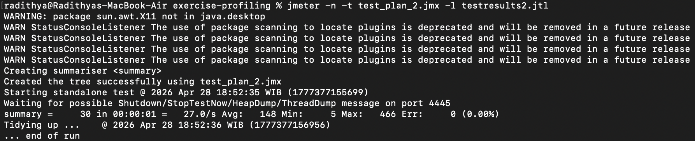
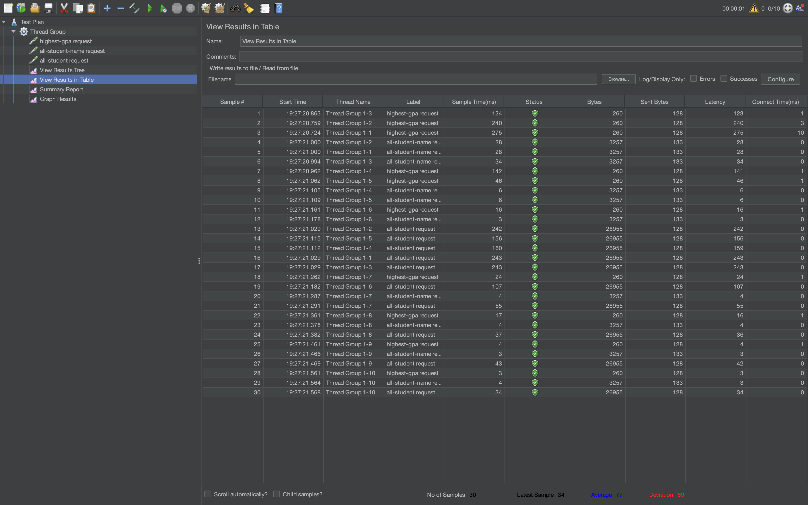

# 1. All Students Name (`/all-student-name`)

# 2. Highest GPA (`/highest-gpa`)

# 3. Test Result (All Students Name)

# 4. Test Result (Highest GPA)

# 5. Refactoring Result

After refactoring, the average time is 77ms while before refactor was 148ms so the improvement is around 47.97%